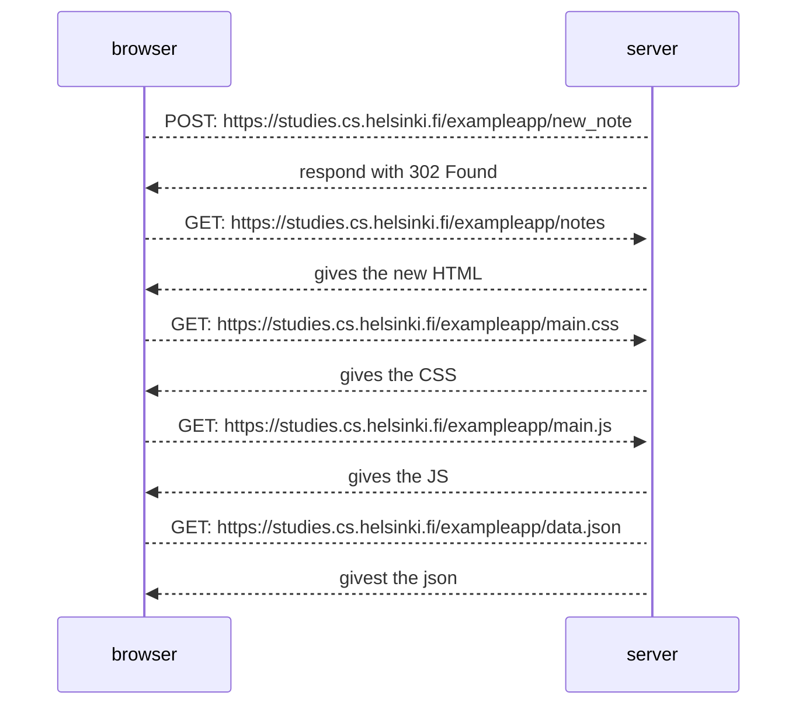

```mermaid
sequenceDiagram
    participant browser
    participant server
    %%user submits form

    browser-->server: POST: https://studies.cs.helsinki.fi/exampleapp/new_note
    activate server
    server-->>browser: respond with 302 Found
    %%server processes the new info and add it to the data structure
    browser-->>server: GET: https://studies.cs.helsinki.fi/exampleapp/notes
    server-->>browser: gives the new HTML
    %%browser found out it needs css & js
    browser-->>server: GET: https://studies.cs.helsinki.fi/exampleapp/main.css
    server-->>browser: gives the CSS
    browser-->>server: GET: https://studies.cs.helsinki.fi/exampleapp/main.js
    server-->>browser: gives the JS
    %%browser make a new get request when running JS
    browser-->server: GET: https://studies.cs.helsinki.fi/exampleapp/data.json
    server-->>browser: givest the json
```
