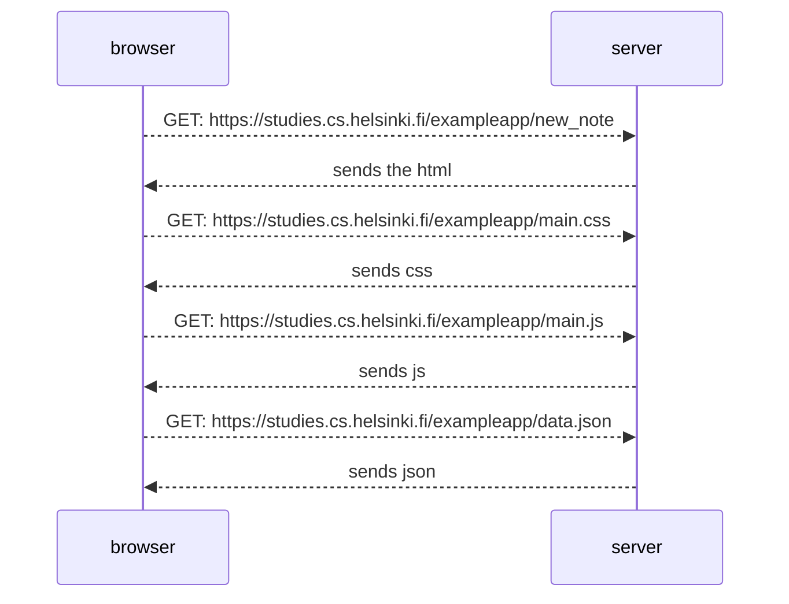

```mermaid
sequenceDiagram
    participant browser
    participant server
    %%user submits form

    browser-->>server: GET: https://studies.cs.helsinki.fi/exampleapp/new_note
    server-->>browser: sends the html
    browser-->>server: GET: https://studies.cs.helsinki.fi/exampleapp/main.css
    server-->>browser: sends css
    browser-->>server: GET: https://studies.cs.helsinki.fi/exampleapp/main.js
    server-->>browser: sends js
    browser-->>server: GET: https://studies.cs.helsinki.fi/exampleapp/data.json
    server-->>browser: sends json
    
```
